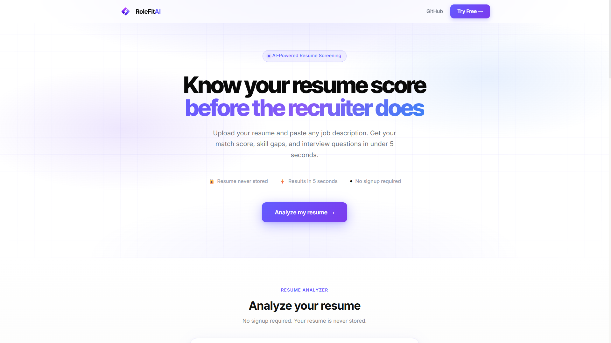
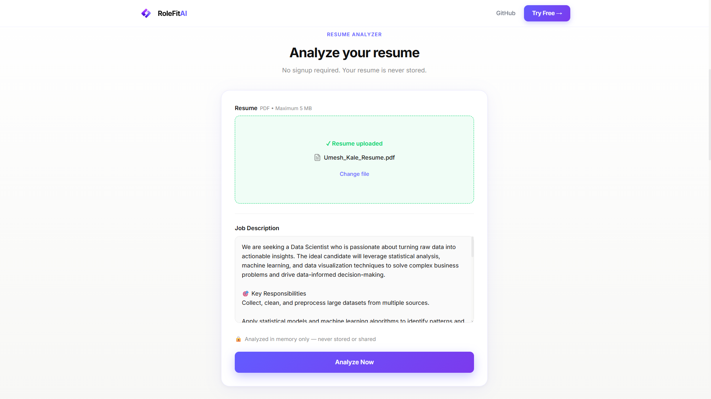
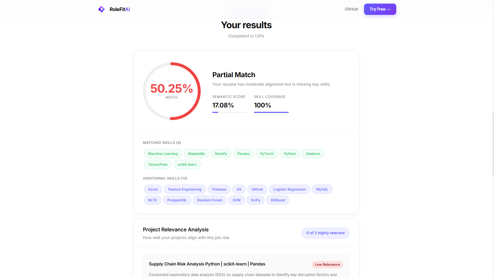
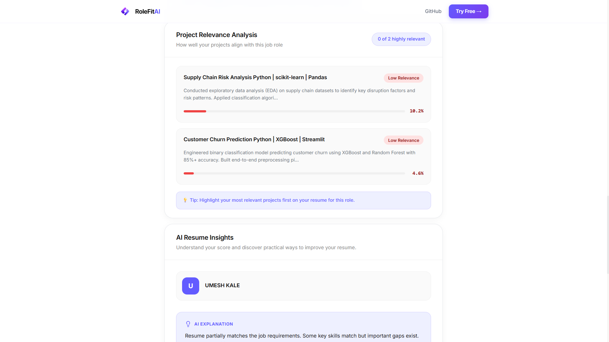
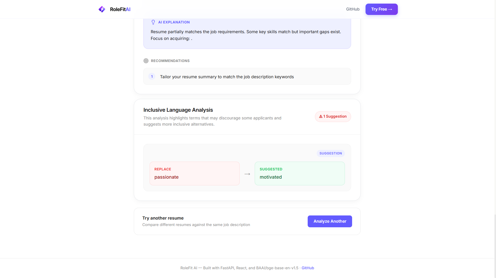

<div align="center">

<h1>RoleFit AI</h1>
<p><strong>AI-powered resume screening, skill gap analysis, project relevance scoring and bias detection</strong></p>

<br/>

<br/>No signup required · Resume never stored · Results in under 5 seconds

<br/>🐛 Report Bug · 💡 Request Feature · ⭐ Star this repo

</div>

## What is RoleFit AI?
RoleFit AI is a production-grade AI resume screening tool built with FastAPI and React — not a Streamlit prototype.
Upload your resume PDF and paste any job description. In under 5 seconds you get:

🎯 **Match score** with semantic understanding  
📂 **Project relevance scoring** — each project scored individually against the role  
🔍 **Skill gap analysis** across 500+ technical skills  
⚖️ **Bias detection** in job descriptions with inclusive rewrites  
💬 **AI-generated interview questions** targeting your exact skill gaps  
💡 **Explainable AI insights** — why you got this score and how to improve  

---

## Screenshots

### Hero


### Resume Analyzer Form


### Match Score + Skills


### Project Relevance Analysis ⭐ New


### AI Insights + Recommendations


---

## Features

| Feature | Details |
|---|---|
| 📄 **Smart PDF Parsing** | `pdfplumber` (primary) + `pyMuPDF` (fallback) — handles tables, columns, complex layouts |
| 🧠 **Hybrid Scoring** | TF-IDF semantic similarity (60%) + skill coverage (40%) |
| 📂 **Project Relevance** | Extracts individual projects and scores each one against the JD |
| 🎯 **Skill Gap Analysis** | 500+ skills across 16 categories with word boundary regex — avoids false positives |
| ⚖️ **Bias Detection** | 150+ biased terms flagged with neutral language suggestions |
| 💬 **Interview Questions** | AI-generated questions for your top missing skills |
| 💡 **Explainability** | Score breakdown + prioritized improvement suggestions |
| 🔒 **Privacy First** | Resume processed in memory — zero persistence, zero third-party sharing |
| 📖 **API Docs** | Auto-generated Swagger UI at `/docs` |
| 🛡️ **Rate Limiting** | Per-IP rate limiting to prevent abuse |
| 📊 **Structured Logging** | Every request logged with timestamp, execution time, and errors |

---

## Live Demo
🔗 https://rolefit-ai-five.vercel.app  
📖 [API Documentation](https://rolefit-ai-xva6.onrender.com/docs)

> ⚠️ **Note:** Backend runs on Render free tier. First request may take 30–50 seconds to wake up. Subsequent requests are fast.

---

## Architecture

User Browser│▼┌─────────────────┐│  Vercel          │  React + Vite (Frontend)│  rolefit-ai.     │  Static hosting, global CDN│  vercel.app      │  Auto-deploys on git push└────────┬────────┘│ REST API (HTTPS)▼┌─────────────────┐│  Render.com      │  FastAPI + Uvicorn (Backend)│  onrender.com    │  Auto-deploys on git push└────────┬────────┘│┌────────▼────────────────────────────────┐│  AI Pipeline                            ││                                         ││  PDF Parser      pdfplumber + pyMuPDF   ││  Preprocessor    spaCy + regex          ││  Skill Extract   500+ skills dictionary ││  Scorer          TF-IDF cosine sim      ││  Project Scorer  per-project relevance  ││  Bias Detector   150+ word ruleset      ││  Interview Gen   Gemini API + fallback  │└─────────────────────────────────────────┘**CI/CD:** Every push to main → auto-deploys backend on Render + frontend on Vercel

---

## Tech Stack

### Backend
| Library | Purpose |
|---|---|
| **FastAPI** | REST API framework with auto Swagger docs |
| **spaCy** | NLP preprocessing and tokenization |
| **scikit-learn** | TF-IDF vectorization + cosine similarity |
| **pdfplumber** | Primary PDF parser — handles tables and columns |
| **pyMuPDF** | Fallback PDF parser for edge cases |
| **Loguru** | Structured logging |
| **SlowAPI** | Rate limiting middleware |
| **Pydantic** | Request/response validation |

### Frontend
| Library | Purpose |
|---|---|
| **React + Vite** | UI framework + build tool |
| **Lucide React** | Icon library |
| **Axios** | HTTP client |

### Deployment
| Service | Purpose |
|---|---|
| **Render.com** | Backend hosting |
| **Vercel** | Frontend hosting |
| **GitHub Actions** | CI/CD pipeline |

---

## API Reference

**Base URL:** `https://rolefit-ai-xva6.onrender.com`

### `POST /api/analyze`
Analyze a resume against a job description.

#### Request (`multipart/form-data`)
| Field | Type | Description |
|---|---|---|
| `resume` | file | PDF file (max 5MB) |
| `job_description` | string | Full job description text (min 50 chars) |

#### Response
```json
{
  "status": "success",
  "processing_time": "2.3s",
  "candidate": {
    "name": "Umesh Kale",
    "email": "umesh@email.com",
    "linkedin": "[linkedin.com/in/umesh-kale9192](https://linkedin.com/in/umesh-kale9192)",
    "github": "[github.com/UMESH-KALE0777](https://github.com/UMESH-KALE0777)"
  },
  "score": {
    "overall": 78.5,
    "semantic": 72.3,
    "skill_coverage": 88.0,
    "label": "Strong Match"
  },
  "skills": {
    "matched": ["Python", "FastAPI", "Docker", "scikit-learn"],
    "missing": ["Kubernetes", "AWS", "Redis"],
    "extra": ["Streamlit", "Matplotlib", "Seaborn"]
  },
  "project_analysis": [
    {
      "title": "Supply Chain Risk Analysis",
      "description": "Built ML model using XGBoost...",
      "relevance_score": 85.2,
      "relevance_label": "Highly Relevant",
      "color": "green"
    },
    {
      "title": "Student CRUD App",
      "description": "Basic Django web application...",
      "relevance_score": 12.1,
      "relevance_label": "Low Relevance",
      "color": "red"
    }
  ],
  "bias_report": {
    "found": true,
    "flagged": [
      { "word": "ninja", "suggestion": "skilled professional" }
    ]
  },
  "interview_questions": [
    {
      "skill": "Kubernetes",
      "questions": [
        "What is the difference between a Pod and a Deployment?",
        "How does Kubernetes handle service discovery?",
        "Explain the role of etcd in Kubernetes."
      ]
    }
  ],
  "explainability": {
    "why_this_score": "Resume strongly matches backend development requirements...",
    "improvement_suggestions": [
      "Add AWS certification or projects",
      "Include Kubernetes experience"
    ]
  }
}
GET /healthJSON{
  "status": "ok",
  "version": "1.0.0",
  "model": "all-MiniLM-L6-v2"
}
Scoring Algorithm$$\text{Final Score} = (\text{Semantic Score} \times 60\%) + (\text{Skill Coverage} \times 40\%)$$Semantic Score $\rightarrow$ TF-IDF cosine similarity between resume and JD textSkill Coverage $\rightarrow$ $\left(\frac{\text{matched JD skills}}{\text{total JD skills}}\right) \times 100$Score Labels:90 – 100 $\rightarrow$ Perfect Match 🟢75 – 89 $\rightarrow$ Strong Match 🟢60 – 74 $\rightarrow$ Good Match 🟡45 – 59 $\rightarrow$ Partial Match 🟡0 – 44 $\rightarrow$ Low Match 🔴Project Structurerolefit-ai/
│
├── backend/
│   ├── app/
│   │   ├── main.py                   ← FastAPI app entry point
│   │   ├── routers/
│   │   │   └── analyze.py            ← POST /api/analyze endpoint
│   │   ├── ai/
│   │   │   ├── parser.py             ← Dual PDF parser
│   │   │   ├── preprocessor.py       ← spaCy text cleaning
│   │   │   ├── embedder.py           ← Semantic similarity
│   │   │   ├── scorer.py             ← Hybrid score calculation
│   │   │   ├── skill_extractor.py    ← Dictionary + regex matching
│   │   │   ├── bias_detector.py      ← 150+ bias word ruleset
│   │   │   ├── interview_gen.py      ← Gemini API + fallback
│   │   │   └── project_extractor.py  ← Project relevance scoring
│   │   ├── models/
│   │   │   └── schemas.py            ← Pydantic models
│   │   └── core/
│   │       ├── config.py             ← Environment settings
│   │       └── logging.py            ← Loguru structured logging
│   ├── data/
│   │   └── skills_dictionary.json    ← 500+ skills, 16 categories
│   ├── Procfile                      ← Render deployment
│   ├── runtime.txt                   ← Python 3.11
│   └── requirements.txt
│
├── frontend/
│   ├── src/
│   │   ├── components/
│   │   │   ├── Navbar.jsx
│   │   │   ├── Hero.jsx
│   │   │   ├── ResumeUploader.jsx
│   │   │   ├── ScoreCard.jsx
│   │   │   ├── ProjectAnalysis.jsx   ← Project relevance UI
│   │   │   ├── BiasReport.jsx
│   │   │   ├── InterviewQuestions.jsx
│   │   │   └── Explainability.jsx
│   │   ├── pages/
│   │   │   └── Home.jsx
│   │   └── api/
│   │       └── analyze.js
│   └── package.json
│
├── screenshots/                      ← App screenshots for README
├── .github/
│   └── workflows/
│       └── deploy.yml                ← CI/CD pipeline
└── README.md
Local SetupPrerequisitesPython 3.11+Node.js 18+GitBackend SetupBash# 1. Clone the repository
git clone [https://github.com/UMESH-KALE0777/rolefit-ai.git](https://github.com/UMESH-KALE0777/rolefit-ai.git)
cd rolefit-ai/backend

# 2. Create and activate virtual environment
python -m venv venv

# Windows
venv\Scripts\activate

# Mac/Linux
source venv/bin/activate

# 3. Install dependencies
pip install -r requirements.txt

# 4. Download spaCy model
python -m spacy download en_core_web_sm

# 5. Create environment file
cp .env.example .env
# Edit .env and add your GEMINI_API_KEY

# 6. Run the backend
uvicorn app.main:app --reload --port 8000
Backend: http://localhost:8000Swagger UI: http://localhost:8000/docsFrontend SetupBash# New terminal from project root
cd frontend

# Install dependencies
npm install

# Run frontend
npm run dev
Frontend: http://localhost:5173Environment VariablesCreate backend/.env:Code snippetGEMINI_API_KEY=your_gemini_api_key_here
ENVIRONMENT=development
MAX_FILE_SIZE_MB=5
RATE_LIMIT_PER_MINUTE=10
ALLOWED_ORIGINS=http://localhost:5173
Get a free Gemini API key at Google AI Studio.What Makes This DifferentMost resume tools are Streamlit prototypes. RoleFit AI is built like a real product:FeatureTypical Resume ToolRoleFit AIArchitectureStreamlit monolithFastAPI + React separatedDeploymentHugging Face SpacesRender + Vercel + CI/CDAI ScoringKeyword matchingSemantic + skill hybridProject Analysis❌ Not available✅ Per-project relevance scoreBias Detection❌ Not available✅ 150+ terms with rewritesPrivacyFiles stored on server✅ Analyzed in memory onlyAPI Docs❌ None✅ Full Swagger UIRate Limiting❌ None✅ Per-IP protectionLogging❌ None✅ Structured Loguru logsFile Validation❌ None✅ Type + size + scanRoadmap[x] Core resume scoring + skill gap analysis[x] Bias detection in job descriptions[x] AI interview question generation[x] Project relevance scoring ⭐[x] Production deployment with CI/CD[x] Structured logging + rate limiting[ ] Google OAuth login[ ] Save and compare analyses (Supabase)[ ] Multi-resume ranking (recruiter mode)[ ] OCR support for scanned PDFs[ ] Resume version history[ ] Fine-tune model on real resume dataContributingContributions are welcome! Here's how to get started:Bash# 1. Fork the repository
# 2. Create your feature branch
git checkout -b feature/amazing-feature

# 3. Make your changes and commit
git commit -m "feat: add amazing feature"

# 4. Push to your branch
git push origin feature/amazing-feature

# 5. Open a Pull Request
LicenseDistributed under the MIT License. See LICENSE for more information.Built with ❤️ by Umesh KaleAI & ML Undergraduate · PDA Engineering College, KalaburagiIf this project helped you, please consider giving it a ⭐It helps others discover the project and motivates continued development.